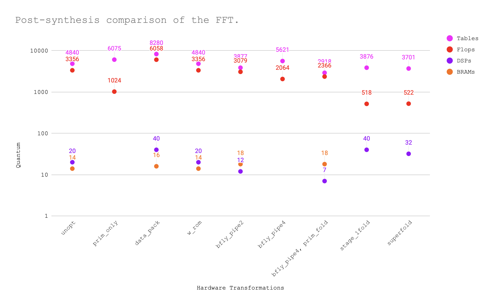

# FFT hardware written in BSV (and also C++).

**_NOTE_**: This codebase uses MIT's lab2 harness from 6.375 for BSV and IITM's FFT from EE5332 for CPP as it's base.

This codebase contains FFT hardware models written in Bluespec System Verilog (and also C++). You may build verilog by using the Bluespec compiler (linked below). There is also a C++ version which can be used for high-level synthesis.

## Prerequisites
1. Text Editor
2. Bluespec Compiler - https://github.com/B-Lang-org/bsc/releases/tag/2024.01

Steps to build verilog from BSV:

```shell
make verilog
```

Steps to build verilog from C++:

```shell
cd cpp ; vivado_hls -f script.tcl
```

These commands will work on a GNU/Linux based machine only. Maybe on a mac if oyu're lucky.
If you need help with using this code elsewhere, or something doesn't work at your end, too bad. You may replicate the synthesis results by tracing the steps back from my commitlog on this github repo.

## FFT Architectures

This codebase implements five architectures for the Pease FFT.

1. Fully Combinational (mkCombinationalFFT)
2. Pipelined to a depth of 4 (mkPipelinedFFT)
3. Folded by pipeline stages (mkFoldedFFT)
4. Folded by both pipeline stages and available butterflies (mkSuperFoldedFFT).
5. Folded further to use a single butterfly (mkUltraFoldedFFT).

The last one mentioned above is under construction as of this commit. However, all architectures have been pretty well described in the figure below.


The hardware described pictorially to the left of the orange coloured arrow, is the fully combinational block (1).
In order to pipeline this, I inserted flops as ISBs in betweent he columns of blue butterfly boxes (2). Now, the latency would be 4 cycles.
I folded the architecture as per the arrows shown in the diagram, in order to isolate the actual compute into a single stage. Essentially, the latency will now remain the same which is 4 cycles, but the throughput will be four times lower as a result of this folding(3). The circuit should now look like what is on the right side of the orange arrow.
In order to fold further, I am trying to use only two butterfly instances overall, as per the arrows shown to the right of the orange arrow (4). The throughput will now reduce by 50%, essentially making it 8 cycles.
Now, we can further fold this two-butterfly implementation to use a single butterfly, further dropping the throughput by 50%, making it 16 cycles(5).

## Synthesis Results as a Figure.



## Synthesis Results as numbers.

|     Transformation    	| Tables 	| Flops 	| DSPs 	| BRAMs 	|
|:---------------------:	|:------:	|:-----:	|:----:	|:-----:	|
|         unopt         	|   4840 	|  3356 	|   20 	|    14 	|
|       prim_only       	|   6075 	|  1024 	|    0 	|     0 	|
|       data_pack       	|   8280 	|  6058 	|   40 	|    16 	|
|         w_rom         	|   4840 	|  3356 	|   20 	|    14 	|
|       bfly_pipe2      	|   3877 	|  3079 	|   12 	|    18 	|
|       bfly_pipe4      	|   5621 	|  2064 	|    0 	|     0 	|
| bfly_pipe4, prim_fold 	|   2918 	|  2366 	|    7 	|    18 	|
|      stage_1fold      	|   3876 	|   518 	|   40 	|     0 	|
|       superfold       	|   3701 	|   522 	|   32 	|     0 	|

## Synthesis Observations.

1. Bluespec generated verilog, somehow, does not infer DSPs until I get to the folded architecture. I've validated that the * operand is indeed present in the generated verilog. im curious curious why.

2. the superfolded architecture does not give you much of an area reduction, because there's just too much multiplexing. this is evident from the bsv itself. still, some reduction can be observed.